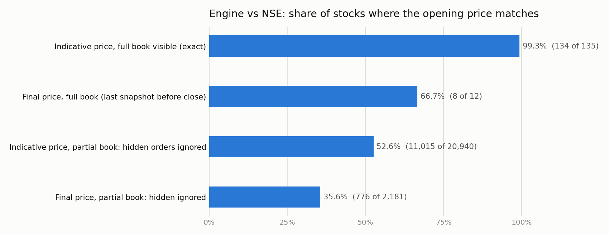
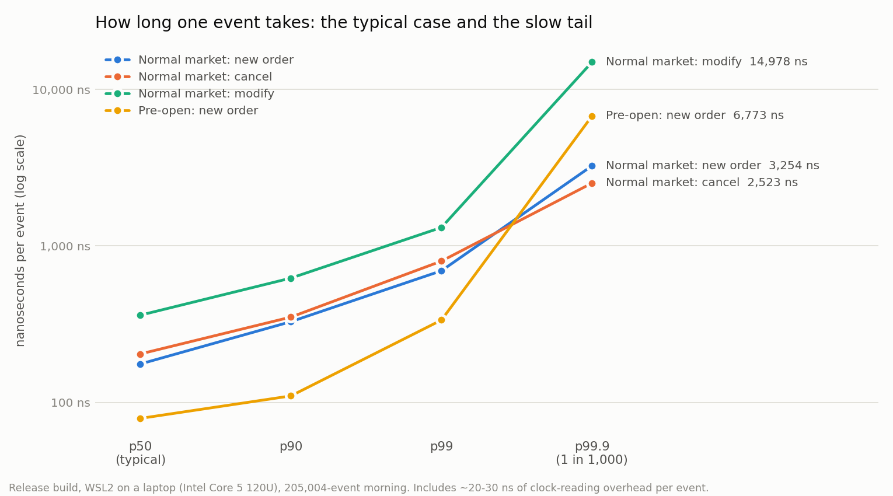

# Mini NSE

A C++20 engine that reproduces how India's National Stock Exchange opens every morning: the **pre-open call
auction** (under the rules in force since 7 September 2026) and the **price-time order book** that takes over
at 9:15. It's checked against NSE's own published prices, against an independent Python implementation on
20,000 random mornings, and timed per event.

| | |
|---|---|
| **Real NSE data** | Matches NSE's indicative opening price on **134 of 135** stocks whose whole book is visible; the one miss is traced to NSE publishing its price one order behind its book |
| **Random cross-check** | **20,000** random mornings vs a separate Python engine: **0 mismatches** (250,000+ trades compared) |
| **Speed** | **5.6–6.5 million events/s**; a new order in the normal market takes **~180 ns** typically, **~0.7 µs** at p99 |
| **Tests** | 67 in `ctest`, including a golden file and a random cross-check; clean under AddressSanitizer and UBSan |

## The problem

From 9:00 to about 9:08 NSE collects orders **without trading**. When order entry closes, at a random moment
between 9:08 and 9:10 so nobody can time it, NSE picks **one opening price** for each stock:

1. the price at which the **most shares** can trade;
2. if tied, the one leaving the **fewest shares unmatched**;
3. if still tied, the one **closest to yesterday's close**. If two are equally close, the close itself.

Everyone trades at that one price: **market orders first, then the better price, then whoever came first**.
Whatever is left moves into the normal market at 9:15, where every order is matched the moment it arrives.

The full rules, each with its source, are in [docs/spec/nse-rules.md](docs/spec/nse-rules.md).

## How it works

```
 morning file ──► Session (phase state machine: PREOPEN → LIMIT_ONLY → AUCTION → CONTINUOUS)
                     │
     9:00–9:10       ├─► AuctionBook      orders collected, nothing trades
     random close    ├─► run_auction()    equilibrium price (3 rules) → fill in priority → leftovers
     9:15            └─► OrderBook        leftovers restored with their original time priority,
                                          then price-time matching for every new order
```

- **Prices are integers (paise).** Floating point can't compare prices exactly, and the "exactly halfway"
  rule depends on exact comparison.
- **Phases come from the input, not a clock**, so the same file always gives the same result
  (tested). That makes every result replayable.
- **The opening table is built in one pass.** Orders are bucketed into sorted price levels; running sums give
  demand and supply at every price in O(levels) instead of O(levels × orders).
- **Auction fills are a two-queue walk.** Sorting each side by (market first, better price, earlier) and
  matching the two fronts reproduces NSE's market-vs-market → market-vs-limit → limit-vs-limit sequence
  without coding it.
- **The order book** keeps, per side, a sorted map from price to a FIFO queue (`std::list`), plus a hash map
  from order id to its queue position, so cancel is O(1). Trades happen at the resting order's price.

## Results

### Against NSE's real data

A collector saves NSE's pre-open data every 30 seconds each trading morning (NSE keeps no history). Every
pre-close snapshot includes NSE's **indicative price computed on that exact book**, so the engine can replay
the same book and must give the same answer.



- **Exact, where the whole book is visible: 134 / 135.** The miss (HYBRIDFIN, 09:00:11) is explained
  automatically: NSE's price equals the book's result with its newest order removed, so NSE published the price
  one order behind the book. Its next snapshot agreed with the engine.
- **Final result, full book: 8 / 12.** All 4 misses are explained by orders arriving in the ~30 s between NSE's
  last refresh and the close (NSE's own last indicative price moved too).
- **Partial books (52.6%)** are an approximation, not a correctness test: NSE shows only ~10 price levels, so
  hidden orders have to be guessed.

Details and every mismatch: [docs/results/real-data-results.md](docs/results/real-data-results.md). One trading day so far
(2026-10-06); the numbers grow as the collector runs.

### Against an independent implementation

[`tools/verify/reference.py`](tools/verify/reference.py) is a deliberately slow, obviously-correct Python version of the
whole session (it tries every price with plain sums and re-sorts lists). [`tools/verify/fuzz.py`](tools/verify/fuzz.py)
generates random mornings on a coarse price grid, so ties, every tie-break rule, market-only auctions and every
reject reason happen often, then diffs both engines line by line.

```
20000 random mornings, 0 mismatches
  auction: HalfwayPreviousClose       239     reject: MarketOrdersClosed   15450
  auction: MarketOrdersOnly           845     reject: OffTick               7614
  auction: MaxTradable               5971     reject: OutsideBand          26339
  auction: MinImbalance              6121     trades: auction             101738
  auction: NearestPreviousClose      4285     trades: normal market       151110
```

### Speed



| Event (Release build, 205,004-event morning) | p50 | p99 | p99.9 |
|---|---|---|---|
| Normal market: new order | 176 ns | 694 ns | 3.3 µs |
| Normal market: cancel | 204 ns | 800 ns | 2.5 µs |
| Normal market: modify | 361 ns | 1.3 µs | 15.0 µs |
| Pre-open: new order | 79 ns | 336 ns | 6.8 µs |
| The whole opening auction (~3,800 waiting orders) | 0.56 ms | | |

**A measured fix:** the first benchmark showed a pre-open new order at **1,162 ns**, 7× a normal-market one,
because the duplicate-id check scanned every earlier order. A hash set of ids brought it to **~80 ns**, with all
tests and 5,000 fresh random mornings re-checked ([commit](../../commit/d3fd1f6)).

Measured on WSL2 on a laptop (Intel Core 5 120U), including ~20–30 ns of clock overhead per event; the tails
are noisy under virtualisation.

## Build and run

Needs a C++20 compiler (GCC 13+ or Clang 16+), CMake 3.22+, and Python 3 for the tools.

```bash
cmake -S . -B build && cmake --build build -j
ctest --test-dir build --output-on-failure            # 67 tests

./build/mini_nse_replay examples/case1_morning.txt    # a whole morning, line by line
python3 tools/verify/fuzz.py --replay build/mini_nse_replay --count 20000

cmake -S . -B build-release -DCMAKE_BUILD_TYPE=Release && cmake --build build-release -j
python3 tools/verify/sessions.py --benchmark > morning.txt
./build-release/mini_nse_bench morning.txt
```

A morning file is plain text; see [examples/case1_morning.txt](examples/case1_morning.txt):

```
PREV_CLOSE 100.00
PHASE PREOPEN
ADD 1 BUY LIMIT 102.00 300
ADD 11 SELL LIMIT 99.00 150
...
PHASE AUCTION          # the random close
PHASE CONTINUOUS       # 9:15
ADD 21 SELL LIMIT 100.00 40
```

## Layout

```
mini-nse/
├── include/mini_nse/       the engine's public headers
│   ├── order.h, trade.h        the vocabulary: prices in paise, orders, trades
│   ├── auction_book.h          pre-open orders, kept in time priority
│   ├── auction.h               equilibrium price, fills and leftovers
│   ├── order_book.h            the 9:15 price-time order book
│   ├── session.h, events.h     one stock's morning as a phase state machine
│   └── script.h, price.h       the morning file format, exact price text
├── src/                    the engine's implementation (one .cpp per header)
├── apps/                   command-line programs
│   ├── replay.cpp              mini_nse_replay: play morning files, print every fact
│   └── bench.cpp               mini_nse_bench: latency percentiles per event
├── tests/                  GoogleTest: the 9 hand-solved cases, phase rules, invariants, determinism
├── examples/               a sample morning and its checked output (a golden-file test)
├── tools/                  Python, standard library only (charts need matplotlib)
│   ├── collect/                collect_preopen.py: saves NSE's pre-open data each morning
│   ├── verify/                 reference engine, random fuzzer, NSE converter, real-data validation
│   └── charts/                 latency_chart.py
├── docs/
│   ├── spec/                   NSE's rules with sources, the 9 test cases and their answers
│   └── results/                real-data results and the charts in this README
├── data/                   not committed: raw/ (laptop collector), cloud/ (cloud collector), results/
├── .github/workflows/      CI: build and run every test on each push
├── CMakeLists.txt
└── LICENSE
```

## Assumptions and limits

- **Rules not confirmed from an NSE circular**, each isolated so it's easy to change: whether leftover orders
  keep their original time priority at 9:15; that only a quantity reduction keeps time priority on modify;
  that an unfilled market order in the normal market is cancelled. See open questions in
  [docs/spec/nse-rules.md](docs/spec/nse-rules.md#8-open-questions-resolve-before-or-during-phase-1).
- **NSE's free data** shows ~10 price levels per stock and refreshes every 30–60 s, which caps how much can
  be checked exactly. Raw data isn't committed; NSE's data isn't mine to republish.
- **One stock per session**, no clearing, margins or circuit breakers (out of scope).

## Next

More trading days of real data; flat arrays indexed by price tick instead of `std::map`; a memory pool for
orders; NSE's closing auction (live since 3 August 2026) and the F&O pre-open session.
